# Facebook Ads vs. Malaria: A Cluster-Randomized Trial in India
<!-- _class: lead -->

Nandan Rao, Dante Donati, Victor Orozco-Olvera
October 2021

---

## The Context: A

:::: columns

::: col
You have an intervention. It's digital. It can be:

1. An advertising campaign.
2. Something that uses an ad campaign as a distribution channel.
:::

::: col
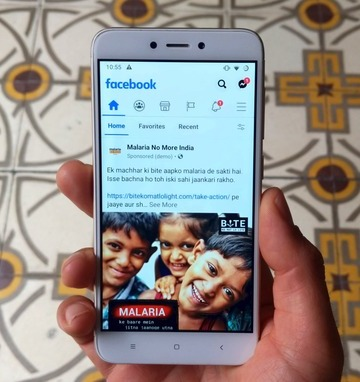
:::

::::

---

## The Context: B

:::: columns

::: col
You want it to impact something other than online behavior. This can be:

1. Knowledge
2. Attitudes
3. Behavior
:::

::: col

:::

::::

---

## The Context: C

:::: columns

::: col
Your outcomes of interest can be self-reported in a survey.

:::

::: col

:::

::::

---

## Example: A Parenting App

You have an app that helps educate parents with new-born children. The app promotes breast feeding, among other things.

You can ask people if they are breast feeding their baby (behavior, measurable via self report)

You can advertise your app online.

---

## Example: An Anti-Malaria Campaign

You want to prevent malaria by encouraging safe behavior, such as using mosquito nets.

You can ask people if they slept under a mosquito net.

You can create an online ad campaign to encourage people to sleep under mosquito nets.

---

## Malaria No More Campaign Evaluation

A collaboration between Facebook's Campaigns for a Healthier World, Upswell, Malaria No More, and the World Bank.

Campaign goals: malaria awareness, protective behavior, and treatment seeking.

---

## Malaria No More Campaign
:::: columns

::: col
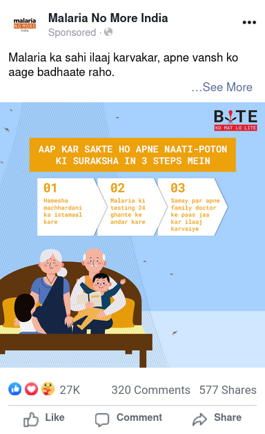

:::

::: col
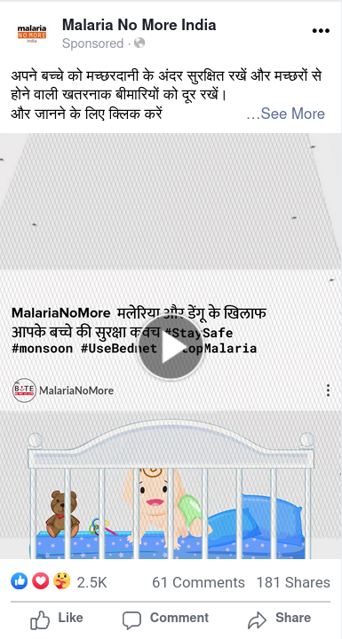
:::

::: col
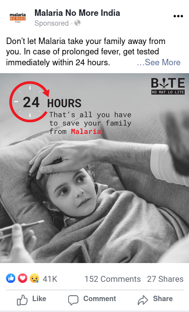
:::
::::

---

# Do the ads work?
<!-- _class: lead -->

---

## An Ideal design

Randomize a population into treatment/control conditions.

Show the treated people ads (for a couple weeks)

Know if treated people are more likely to sleep under mosquito nets.

---

## An Ideal (commercial) design

Randomize a population into treatment/control conditions.

Show the treated people ads (for a couple weeks).

Know if treated people are more likely to **buy your shoes.**

---

## An (almost) Ideal design

Recruit some study participants online.

Tell them you're doing a survey. Ask them some questions, then tell them you'll ask them more questions in a couple of weeks.

Sneakily advertise to them.

Ask them if they slept under a bednet last night.

See if the treatment group is more likely to **report** sleeping under mosquito nets.

---

## An (almost) Ideal design

Recruit some study participants online **via Facebook**.

Tell them you're doing a survey. Ask them some questions, then tell them you'll ask them more questions in a couple of weeks.

Sneakily advertise to them **via Facebook**.

Ask them if they slept under a bednet last night.

See if the treatment group is more likely to **report** sleeping under mosquito nets.

---

## Remarketing

Offered by all major ad platforms.

Run campaign micro-targeted to group of individuals who have previously interacted in some way with the advertiser.

"Advertiser" is based on ownership, not visible advertisement entity.

Interaction means interacting with a previous ad or connecting their account (i.e. sign in with FB/Google).

---

## Recruiting

:::: columns

::: col
Use Facebook ads to recruit respondents directly from Facebook.

Offer mobile credit as an incentive to finish the survey.

Use Virtual Lab to create ad sets for each stratum and optimize spend across ad sets.
:::

::: col
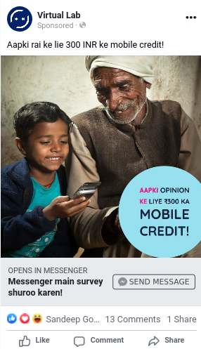
:::

::::

---

## Surveying

:::: columns

::: col
All surveying was done via chatbot on Facebook Messenger (Virtual Lab).

Mobile credit payment was integrated into the chatbot.

Chatbot allows for seamless follow ups / experience sampling.
:::

::: col

:::

::::

---

## Real ads. Real timelines.

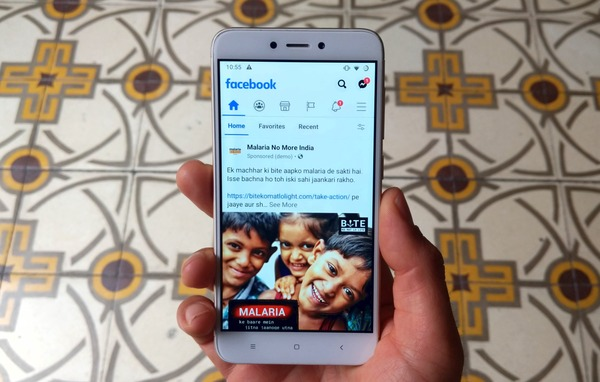

---

# So do the ads work?
<!-- _class: lead -->

---

## Individual Level Results

:::: columns

::: col
---ols-(subset).png)
:::

::: col

**Marginal effect**
69\% > 75\%

No heterogeneity.

:::

::::

---

## Individual Level Results

:::: columns

::: col
---ols.png)
:::

::: col

We also asked:

_"Thinking about yesterday, did you/your family use long-sleeve clothing to prevent mosquito bites?"_

There were no ads specifically mentioning long sleeves.

:::

::::

---

# So who do the ads work on?
<!-- _class: lead -->

---

## Stratification

Are Facebook ads effective in the fight against malaria?

(concern) Aren't those most affected by Facebook ads least affected by malaria?

(solution) Stratify:

1. Let's determine who malaria affects the most and the least.
2. Let's measure effects of the campaign on both groups.

---

## Baseline insights

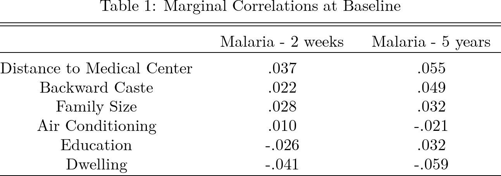

---

## What is Dwelling???

Respondents were asked which kind of house they live in:

1. Kutcha (made of mud, tin, straw)
2. Pucca (have cement/brick wall and floor)
3. Semi-pucca

---

# Ok, how do you stratify on kutcha?
<!-- _class: lead -->

---

## Ad Optimization

Major ad platforms offer a variety of "optimization" tools.

The goal of these tools is to ensure that your ads go to those who are most likely to _____ (_conversion event_).

One of these tools, on Facebook, is known as "Lookalike Audience".

---

## Lookalike Audiences

One-class classification problem.

You give them a set of people and pick a percentage between 1%-20%.

They give you an audience that is 1-20% of the population that is "most like" the set of people you gave them.

Kutcha lookalike!

---

## Optimizing recruitment for dwelling

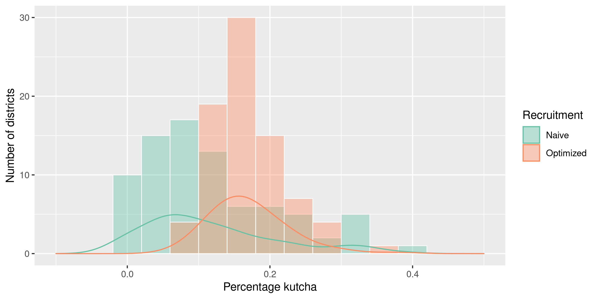

---

## Virtual Lab

Virtual Lab is an open-source platform for performing surveys and experiments within digital ad platforms.

https://vlab.digital
* Uses advertiser APIs to optimize recruitment.
* Chatbot survey platform (+ web survey integration coming).
* Payment/incentive integration with mobile recharges.
* Allows retargeting for ad experiments.

---

# So does an ad campaign work at scale?
<!-- _class: lead -->

---

## Malaria No More Campaign

:::: columns

::: col
Ran across 22 states.

133M people reached.

Stratified by age, gender, or capital/else.

September - November 2020.
:::

::: col

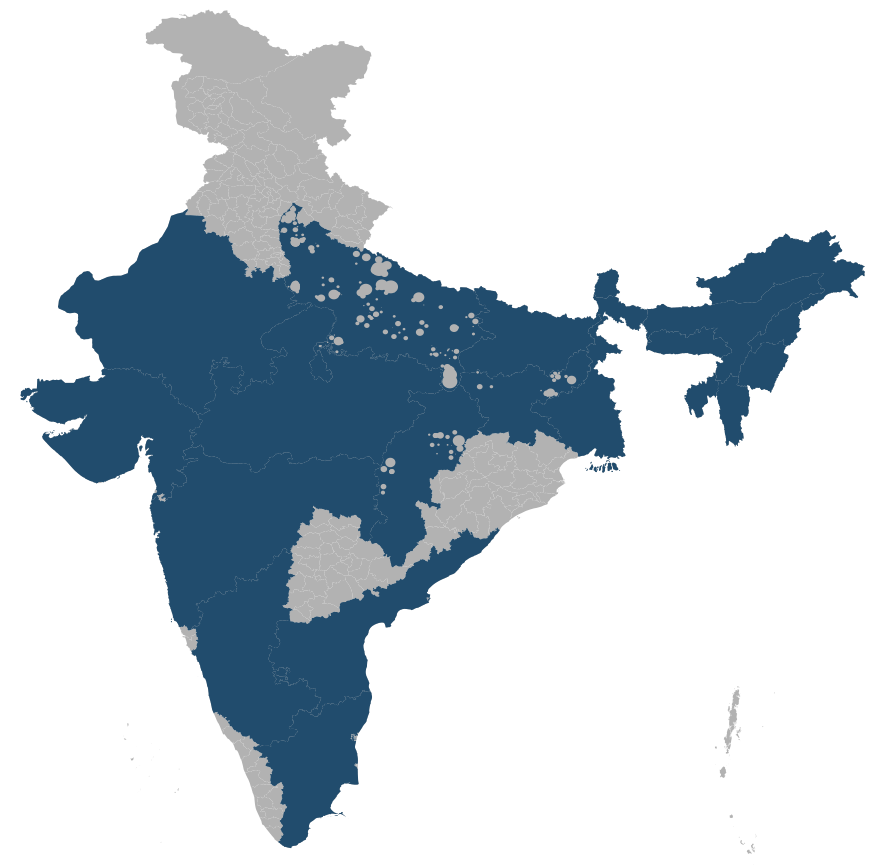

:::
::::

---

## Survey Recruitment Campaign

:::: columns

::: col
Stratified across 80 districts and 2 dwelling types.

July - December 2020.

January - March 2020.

:::

::: col

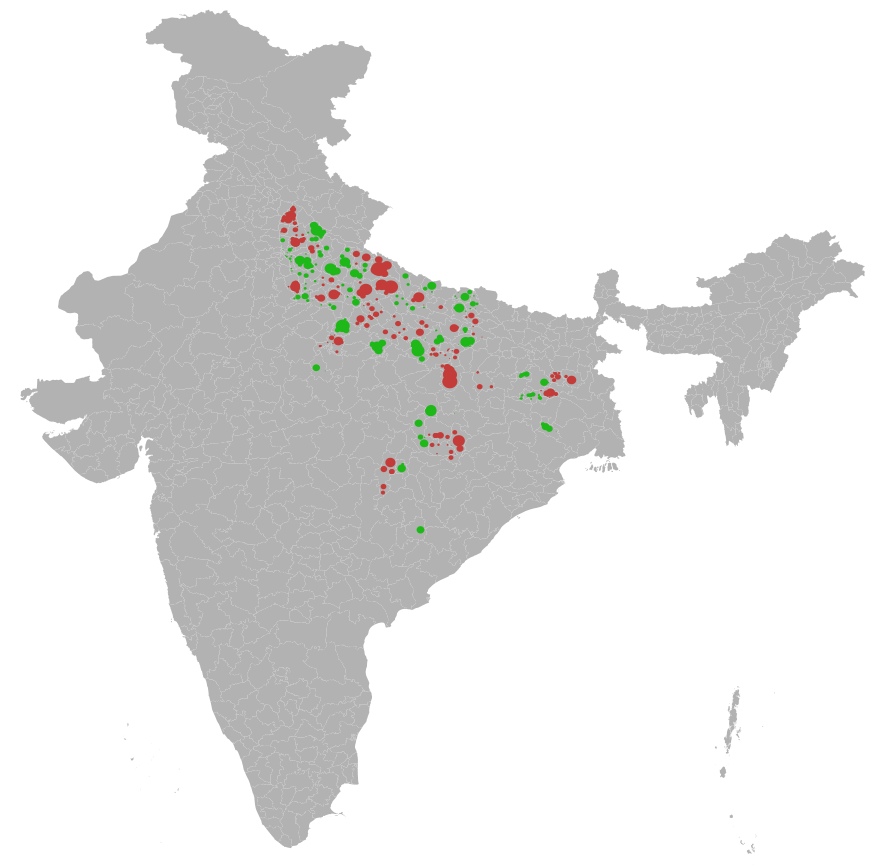

:::
::::

---

## Stratify, stratify, stratify

160 strata!

Use Virtual Lab to optimize spend dynamically.

160 adsets!

Most expensive districts > 50x that of cheap districts

---

## Timeline

* **July 2020:** Launch baseline of "round 1" panel survey.
* **September 2020:** Launch country-wide Malaria No More ad campaign
* **November 2020:** Finish country-wide Malaria No More ad campaign
* **December 2020:** Finish "round 1" panel survey
* **January 2020:** Launch "round 2" cross-section survey.
* **March 2020:** Finish "round 2" cross-section survey.

---

#
<!-- _class: centered -->

### Data and Results

---

## Data - Round 1 Panel

We create a panel dataset with respondents asked questions every 17 days regarding:

1. Incidence (malaria/fever)
2. Treatment seeking (in case of malaria/fever)
3. Behavior (did you sleep under a mosquito net?).

This lasted for up to 9 waves, ending December 18th with an endline survey.

---

## Data - Round 2 Cross Section

Single cross sectional survey. Respondents asked about:

1. Incidence (malaria/fever)
2. Treatment seeking (in case of malaria/fever)

With a subset of this group becoming part of the "individual level study" and were later asked about behaviors.

---

## Model

Basic random effects model binomial specification for analysis:

$$
logit(\pi_{ih}) = \alpha + \sum_j \beta_j x_{jih} + u_h \\
u_h \sim \mathcal{N}(0, \sigma_B^2)
$$

(we also run OLS with clustered standard errors as robustness check.)

---

## Question: Behavior

**Self:** _Did you sleep under a mosquito net last night?_

**Household:** _How many family members that live in your house (including yourself) slept under a mosquito net last night?_

---

## Results: Behavior
<!-- _class: small-text -->
:::: columns

::: col
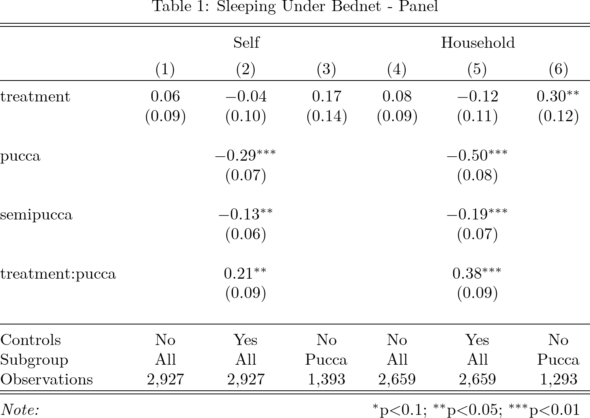
:::

::: col
Marginal effects

**R1 (pucca)**
**Self:** 61.1\% > 65\%
**HH:** 61.2\% > 67.6\%
:::

::::

---

## Question: Incidence

**Panel:** _Have you/someone in your family had Malaria in the last two weeks?_
**Cross Section:** _Have you/someone in your family had Malaria since last August?_

---

## Results
<!-- _class: small-text -->

:::: columns

::: col
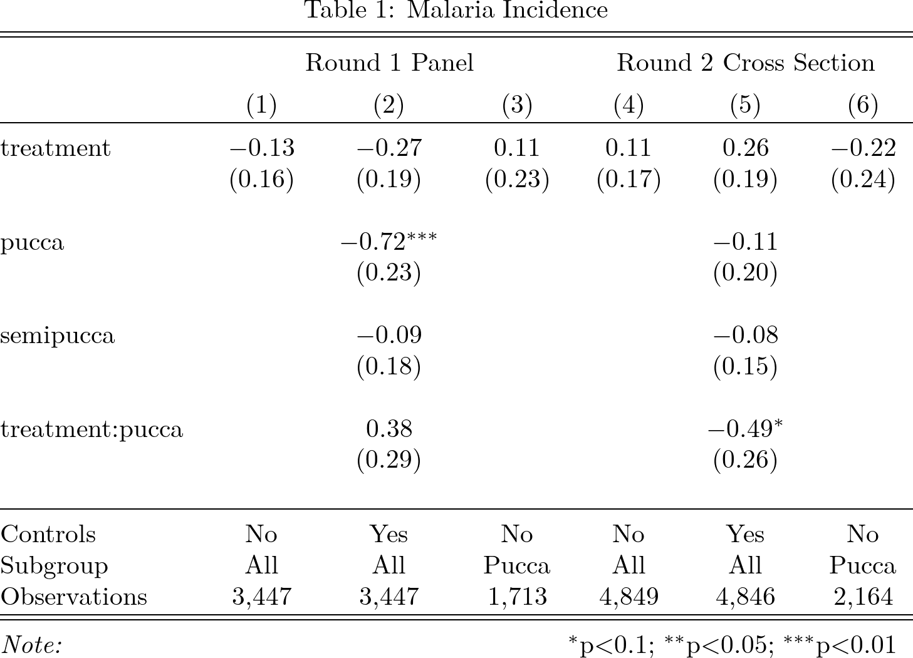
:::

::: col
Marginal effects (not sig.)

**R2 (pucca)**
4.6\% > 3.7\% (0.81 OR)

:::

::::

---

## Question: Treatment Seeking

**Question:** _Did you seek medical help?_

If they answered yes to either:

**Panel:** _Have you/someone in your family had a fever (100.4F / 38C or above) in the last two weeks?_

**Cross Section:** _Have you/someone in your family had a fever (100.4F / 38C or above) since last August?_

---

## Results
<!-- _class: small-text -->

:::: columns

::: col
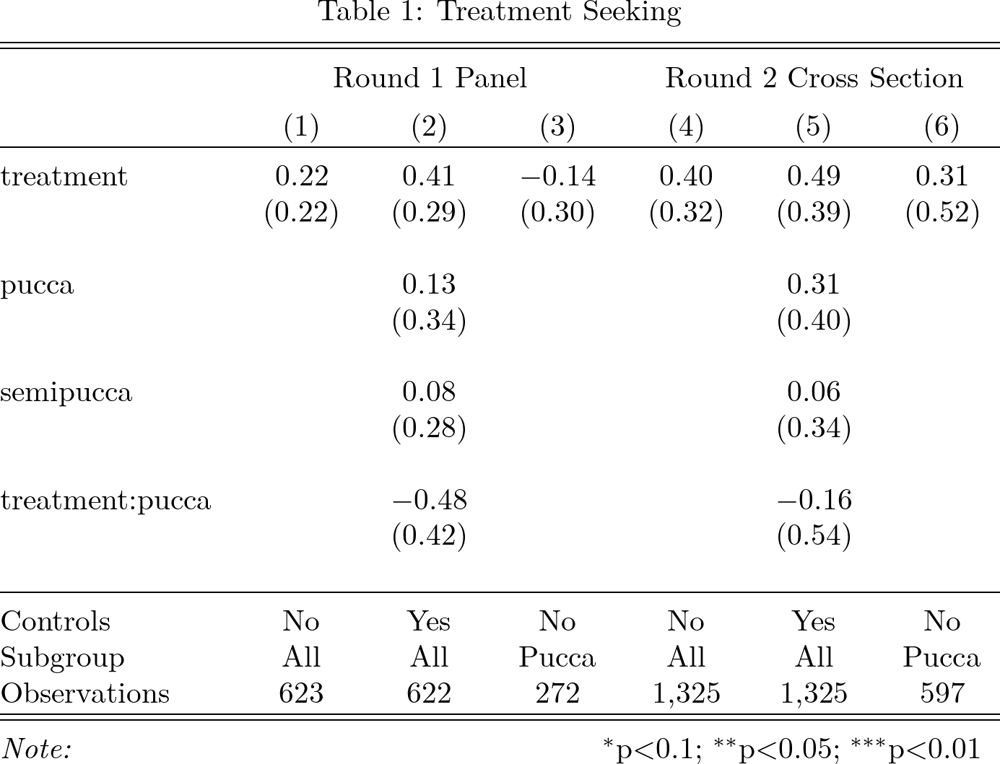
:::

::: col

Marginal effects (not sig.)

**R1 (non-pucca)**
86\% > 91\%

**R2 (non-pucca)**
95\% > 97\%

:::

::::

---

## Conclusions

The ad material itself had a direct impact on preventative behavior.

The ad campaign seemed to have population-level impact on one subgroup (pucca)

**Hypothesis:** The campaign material could have had an impact on behavior (mosquito nets) for those in kutcha dwellings, but it did not reach them.

---

## Conclusions

Policies and interventions affect subpopulations differently.

Measuring effects on different populations can be hard.

Digital advertising can be used for recruitment and help via microtargeting.

If we stratified by dwelling to recruit, can we do the same in the campaign itself?

---

## References
