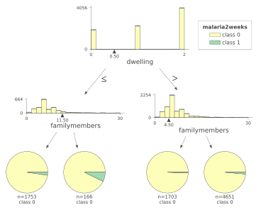
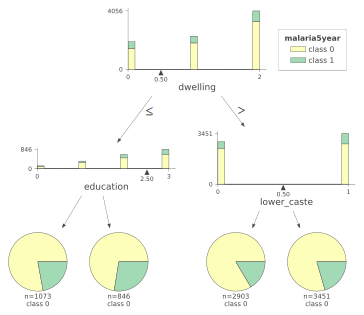

# Facebook Ads vs. Malaria: A Cluster-Randomized Trial in India
<!-- _class: lead -->

Nandan Rao, Dante Donati, Victor Orozco-Olvera
Advisor: Caterina Calsamiglia
Tutor: Francesc Trillas
June 2021

---

## Outline

1. Overview
2. Background & Contribution
2. Cluster Level Design/Results
2. Individual Level Design/Results
3. Conclusions

---

## Research Question

Smartphone growth and internet access is expanding.

However, it is least expansive in poor, rural areas.

Malaria disproportionately affects those in poor, rural areas.

Can Facebook ads help against malaria?

---

## Who?

A collaboration between Facebook's Campaigns for a Healthier World, Upswell, Malaria No More, and the World Bank.

Campaign goals: malaria awareness, protective behavior, and treatment seeking.

We (researchers) get 3 states in India in which we can randomize campaign application by geography.

---

## Study Design (1000m view)

**Cluster level:**
80 districts in which we collect surveys. 40 treated, 40 control.
Campaign run by ad team (2nd half of 2020)
Measure population-level effects.

**Individual level:**
1791 individuals surveyed (Q1 2021)
Direct advertising via remarketing.
Measure individual-level effects.

---

<!-- ## Study Design (1000m view) -->

<!-- Stratify by dwelling type: -->

<!-- **Kutcha:** Mud/Straw/Tin -->

<!-- **Pucca:** Concrete/Brick -->

<!-- (There is also semi-pucca) -->

<!-- --- -->

## Findings

**Preventative behavior (sleeping under mosquito net):**

1. Population level effects for those who live in concrete/brick dwelling type.
2. Individual level effects for those who live in any dwelling type.

**Malaria Incidence (self-reported):**
3. Suggestive evidence for heterogeneous effects across dwelling type.

---

#
<!-- _class: centered -->

### Background \& Contribution

---

## Background \& Contribution

1. Ad campaigns for public health outcomes in low- and middle-income countries.
2. Evaluating behavior change in (digital) social marketing campaigns.

---

## Ads for public health in LMICs

Some evidence for reproductive health in Pakistan, attitudes towards smoking in Brazil, and preventative behaviors related to cancer screening in Thailand.

The latter being the only full-scale RCT, flyers + in-person program.

There have been cluster-randomized trials in high-income countries for traditional media campaigns. Any for digital campaigns?

---

## Evaluating behavior change

Social marketing focuses on the use of marketing tools for behavior change.

Review of social media social marketing campaigns by Shawky et. al. in 2019[^Shawky2019] shows:

1. 24 studies measured effectiveness
2. 24/24 measured "on-platform" engagement
3. 12/24 measured "off-platform" conversions
4. 0/24(?) measured offline behavior change

[^Shawky2019]: Sara Shawky et al. “Using social media to create engagement: a social marketin review”. In: Journal of Social Marketing 9.2 (2019).

---

## How marketing tools work

Provide measurements for "on-platform" results.

Provide tools (SDKs) for "off-platform" results.

All results aggregated to ad platform, where they own the data and provide tools.

Companies generally interested in "on-platform" engagement as a means to "off-platform" engagement which is the end goal.

Result: measuring engagement easy due to wealth of tools.

---

## Lab studies

To get around this limitation, behavioral researchers (and marketing professionals) often study the effects of information or ad content in a "lab" setting.

Public relations / market research companies offer pools of paid respondents and tools to show ads to them.

Downsides: Participants are conscious of the relationship between the ad and the questions. Forms part of the same study.

---

## Our contribution

We contribute two study designs and an open source software tool (Virtual Lab) to this literature:

1. Geographic (cluster-level) randomization with stratified survey respondents recruited via digital ad platforms.

2. Individual-level randomization and realistic measurement of ad effect with remarketing.

---

## Remarketing

Offered by all major ad platforms.

Run campaign micro-targeted to group of individuals who have previously interacted in some way with the advertiser.

"Advertiser" is based on ownership, not visible advertisement entity.

Interaction means interacting with a previous ad or connecting their account (i.e. sign in with FB/Google).

---

## Virtual Lab

Virtual Lab is an open-source platform for performing surveys and experiments within digital ad platforms.

https://vlab.digital
* Uses advertiser APIs to optimize recruitment.
* Chatbot survey platform (+ web survey integration coming).
* Payment/incentive integration with mobile recharges.
* Allows retargeting for ad experiments.

---

#
<!-- _class: centered -->

### Study Design (Cluster Level)

---

## Stratification

Are Facebook ads effective in the fight against malaria?

(concern) Aren't those most affected by Facebook ads least affected by malaria?

(solution) Stratify:

1. Let's determine who malaria affects the most and the least.
2. Let's measure effects of the campaign on both groups.

---

## Recruiting

:::: columns

::: col
Use Facebook ads to recruit respondents directly from Facebook.

Offer mobile credit as an incentive to finish the survey.

Use Virtual Lab to create ad sets for each stratum and optimize spend across ad sets.
:::

::: col

:::

::::

---

## Surveying

:::: columns

::: col
All surveying was done via chatbot on Facebook Messenger (Virtual Lab).

Mobile credit payment was integrated into the chatbot.

Chatbot allows for seamless follow ups / experience sampling.
:::

::: col

:::

::::

---

## Timeline

* **July 2020:** Launch baseline of "round 1" panel survey.
* **September 2020:** Launch country-wide Malaria No More ad campaign
* **November 2020:** Finish country-wide Malaria No More ad campaign
* **December 2020:** Finish "round 1" panel survey
* **January 2020:** Launch "round 2" cross-section survey.
* **March 2020:** Finish "round 2" cross-section survey.

---

## Baseline insights

---

## Baseline insights - Trees

:::: columns
::: col

:::
::: col

:::
::::

---

## What is Dwelling???

Respondents were asked which kind of house they live in:

1. Kutcha (made of mud, tin, straw)
2. Pucca (have cement/brick wall and floor)
3. Semi-pucca

---

## Optimizing recruitment for dwelling

We stratify all recruitment by dwelling (in addition to district).

This allows us to do subgroup analysis by dwelling, which is a simple, transparent way to split respondents by a proxy for malaria risk.

How to recruit by dwelling type? Lookalike audience.

Leads to 160 strata.

---

## Optimizing recruitment for dwelling

---

## Malaria No More Campaign

:::: columns

::: col
Ran across 22 states.

133M people reached.

Stratified by age, gender, or capital/else.

September - November 2020.
:::

::: col

:::
::::

---

## Survey Recruitment Campaign

:::: columns

::: col
Stratified across 80 districts and 2 dwelling types.

July - December 2020.

January - March 2020.

:::

::: col

:::
::::

---

#
<!-- _class: centered -->

### Data and Results

---

## Data - Round 1 Panel

We create a panel dataset with respondents asked questions every 17 days regarding:

1. Incidence (malaria/fever)
2. Treatment seeking (in case of malaria/fever)
3. Behavior (did you sleep under a mosquito net?).

This lasted for up to 9 waves, ending December 18th with an endline survey.

---

## Data - Round 2 Cross Section

Single cross sectional survey. Respondents asked about:

1. Incidence (malaria/fever)
2. Treatment seeking (in case of malaria/fever)

With a subset of this group becoming part of the "individual level study" and were later asked about behaviors.

---

## Model

Basic random effects model binomial specification for analysis:

$$
logit(\pi_{ih}) = \alpha + \sum_j \beta_j x_{jih} + u_h \\
u_h \sim \mathcal{N}(0, \sigma_B^2)
$$

(we also run OLS with clustered standard errors as robustness check.)

---

## Question: Behavior

**Self:** _Did you sleep under a mosquito net last night?_

**Household:** _How many family members that live in your house (including yourself) slept under a mosquito net last night?_

---

## Results: Behavior
<!-- _class: small-text -->
:::: columns

::: col

:::

::: col
Marginal effects

**R1 (pucca)**
**Self:** 61.1\% > 65\%
**HH:** 61.2\% > 67.6\%
:::

::::

---

## Question: Incidence

**Panel:** _Have you/someone in your family had Malaria in the last two weeks?_
**Cross Section:** _Have you/someone in your family had Malaria since last August?_

---

## Results
<!-- _class: small-text -->

:::: columns

::: col

:::

::: col
Marginal effects (not sig.)

**R2 (pucca)**
4.6\% > 3.7\% (0.81 OR)

:::

::::

---

## Question: Treatment Seeking

**Question:** _Did you seek medical help?_

If they answered yes to either:

**Panel:** _Have you/someone in your family had a fever (100.4F / 38C or above) in the last two weeks?_

**Cross Section:** _Have you/someone in your family had a fever (100.4F / 38C or above) since last August?_

---

## Results
<!-- _class: small-text -->

:::: columns

::: col

:::

::: col

Marginal effects (not sig.)

**R1 (non-pucca)**
86\% > 91\%

**R2 (non-pucca)**
95\% > 97\%

:::

::::

---

#
<!-- _class: centered -->

### Individual Level Design/Results

---

## Design

* Data for round 2 cross section collected in 2 waves, with the second wave collected 3-12 weeks after the first phase.

* After first phase, participants (N=4908) randomized into treatment/control groups (balanced across gender, caste, education, dwelling-type, 2020 treatment assignment).

* Treatment group targeted via remarketing. 2 weeks. 6.6 ads each.

* 10 days later, they were asked follow up questions.

---

## Remarketing
<!-- _class: small-text -->

:::: columns

::: col

The survey was conducted via a page named "Global Insights"

The marketing campaign was conducted from the Malaria No More India page.

Real marketing campaign (real auctions, real $$$)

:::
::: col

:::
::::

---

## Results

:::: columns

::: col
---ols-(subset).png)
:::

::: col

**Marginal effect**
69\% > 75\%

No heterogeneity.

:::

::::

---

## Conclusions

The ad material itself had a direct impact on preventative behavior.

The ad campaign seemed to have population-level impact on one subgroup (pucca)

**Hypothesis:** The campaign material could have had an impact on behavior (mosquito nets) for those in kutcha dwellings, but it did not reach them.

---

## Conclusions

Policies and interventions affect subpopulations differently.

Measuring effects on different populations can be hard.

Digital advertising can be used for recruitment and help via microtargeting.

If we stratified by dwelling to recruit, can we do the same in the campaign itself?

---

## References
